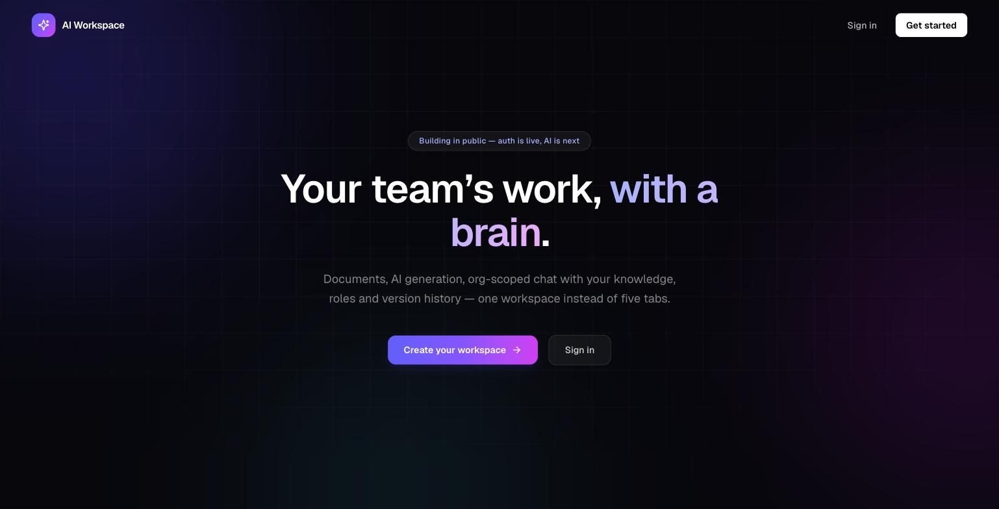
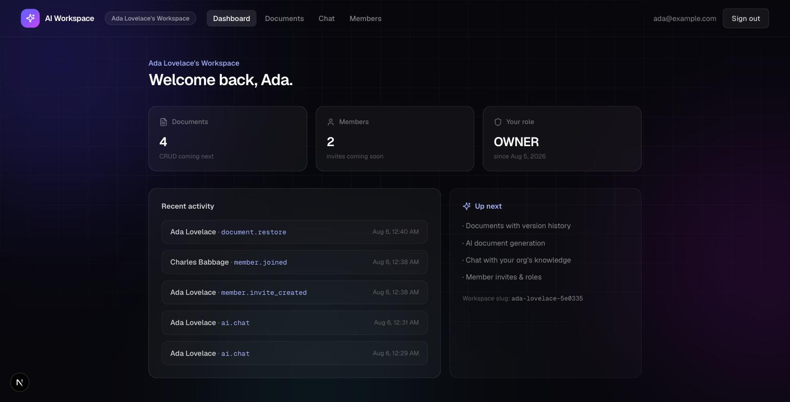
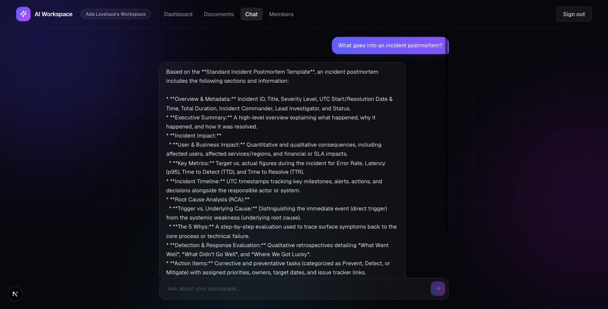
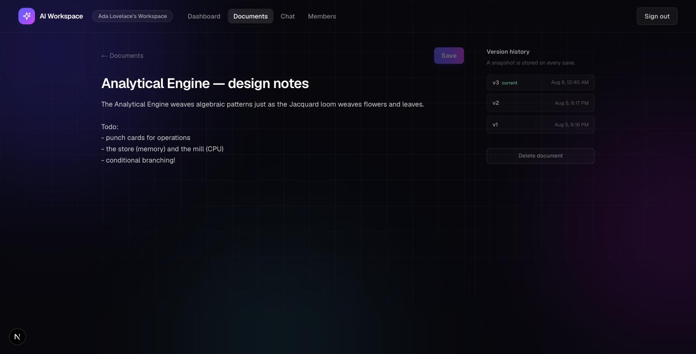
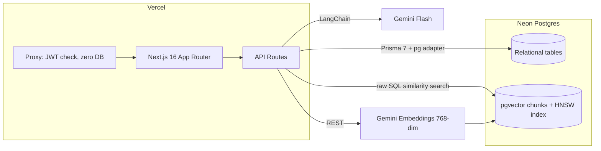

# AI Workspace

**Notion + ChatGPT + GitHub, for teams — documents, AI generation, and org-scoped RAG chat in one app.**

🔗 **Live demo:** [ai-workspace-self-13fa.vercel.app](https://ai-workspace-self-13fa.vercel.app)

Built by [Himanshu Sharma](https://github.com/himanshusharma8583) as a production-grade full-stack project. Runs entirely on free tiers (Vercel + Neon + Gemini), designed so the same architecture would hold up at a million users.



## Features

- 🔐 **Authentication** — credentials auth (Auth.js v5), bcrypt hashing, JWT sessions, protected routes via Next.js 16 proxy
- 🏢 **Multi-tenant organizations** — every user gets a workspace; invite teammates with single-use, expiring links
- 👥 **Role-based permissions** — OWNER / ADMIN / MEMBER / VIEWER, enforced in every API route
- 📝 **Documents with version history** — a snapshot on every save; restore any version (history is append-only, restores become new versions)
- ✨ **AI document generation** — describe what you need, Gemini drafts it into an editable, versioned document
- 💬 **Chat with your documents (RAG)** — answers grounded in your org's knowledge with clickable source citations; refuses to invent answers
- 📋 **Activity logs** — every mutation recorded per organization

| Dashboard | RAG chat with citations |
|---|---|
|  |  |



## Architecture



**RAG pipeline:** on every save, the document is chunked (~1200 chars, 200 overlap) → embedded → stored in `DocumentChunk` with a denormalized `organizationId`. A question is embedded the same way, and one SQL query does tenant filtering + cosine similarity via the HNSW index. Top chunks go to Gemini with instructions to answer only from context and cite sources.

## Engineering decisions

| Decision | Why |
|---|---|
| **pgvector inside Postgres** instead of Pinecone/Qdrant | One less service to run and pay for; vector search joins directly against relational data, so tenant filtering happens in the same indexed query |
| **JWT sessions + edge-safe auth split** | The route-protection proxy verifies a signed cookie — zero database reads per navigation. Prisma never loads in that hot path |
| **Tenant isolation by construction** | Every query on business data is scoped by `organizationId` through one shared helper. A valid document ID from another org returns 404 |
| **Cursor pagination** | Page 500 costs the same as page 1; compound indexes (`[organizationId, updatedAt]`) match the exact query shape |
| **Plain-text AI output format** instead of JSON | Long Markdown inside JSON strings made the model botch escapes ~1 in 3 calls. A `TITLE:` line + `---` + raw body has nothing to escape — failure rate dropped to zero |
| **Append-only version history** | Restoring an old version creates a new version rather than rewriting history — you can restore a restore |
| **Per-user AI rate limits** | Enforced by counting indexed activity-log rows, not in-memory state, so limits hold across serverless instances |

## Stack

Next.js 16 (App Router) · TypeScript · Tailwind CSS v4 · Prisma 7 (driver adapters) · Neon Postgres + pgvector · Auth.js v5 · LangChain + Google Gemini · Zod v4 · Vercel

## Running locally

```bash
git clone https://github.com/himanshusharma8583/ai-workspace.git
cd ai-workspace
npm install
```

Create `.env` in the project root:

```
DATABASE_URL=postgresql://...   # any Postgres with the pgvector extension (Neon free tier works)
AUTH_SECRET=...                 # npx auth secret
GEMINI_API_KEY=...              # https://aistudio.google.com
```

Then:

```bash
npx prisma db push              # creates tables (enable pgvector: CREATE EXTENSION vector;)
npm run dev
```

## Roadmap

File uploads · AI meeting summaries · Redis rate limiting (Upstash) · Stripe test-mode billing · AI code assistant · real-time collaboration
